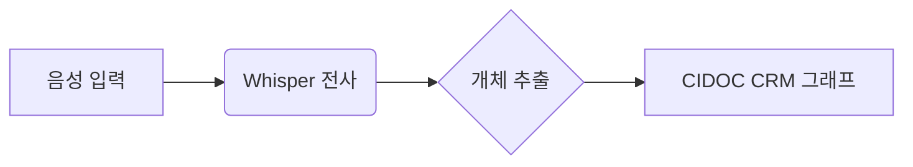

# MD Viewer 데모 문서

이 문서는 뷰어가 지원하는 문법 전체를 검증하기 위한 샘플이다. [[문법-검증]] 위키링크와 [일반 링크](https://example.com), `인라인 코드`, **굵게**, *기울임*, ~~취소선~~을 포함한다.

> [!note] 
> Obsidian 콜아웃이다. 추론 서버는 outbound-only 방화벽 제약을 준수한다.

> [!warning]
> 경고 타입 콜아웃 — 색이 달라야 한다.

## 표 (GFM)

| 모듈 | 역할 | 스택 |
|------|------|------|
| Transcriber | 음성 → 텍스트 전사 | Whisper / vLLM |
| Extractor | 개체·관계 추출 | Python |
| GraphWriter | CIDOC CRM 적재 | C + SPARQL |

## 수식 (KaTeX)

인라인 수식 $E = mc^2$ 와 블록 수식:

$$
\mathcal{L}_{total} = \mathcal{L}_{rec} + \lambda \cdot \mathcal{L}_{KG}, \quad \lambda \in [0.1, 0.5]
$$

## 코드 하이라이트

```python
# entity extraction entry
def extract(chunk: str) -> Graph:
    ents = ner_model.run(chunk)
    return to_cidoc(ents, schema="E22_Man-Made_Object")
```

## Mermaid 다이어그램



## 작업 목록

- [x] GFM 표·작업 목록 렌더링
- [x] KaTeX 수식 지원
- [x] Mermaid 다이어그램 연동
- [ ] 검색 기능 (v0.2)

## 각주

지식 그래프 스키마는 CIDOC CRM[^1]을 따른다.

[^1]: ISO 21127:2023 — 문화유산 정보의 개념 참조 모델.
